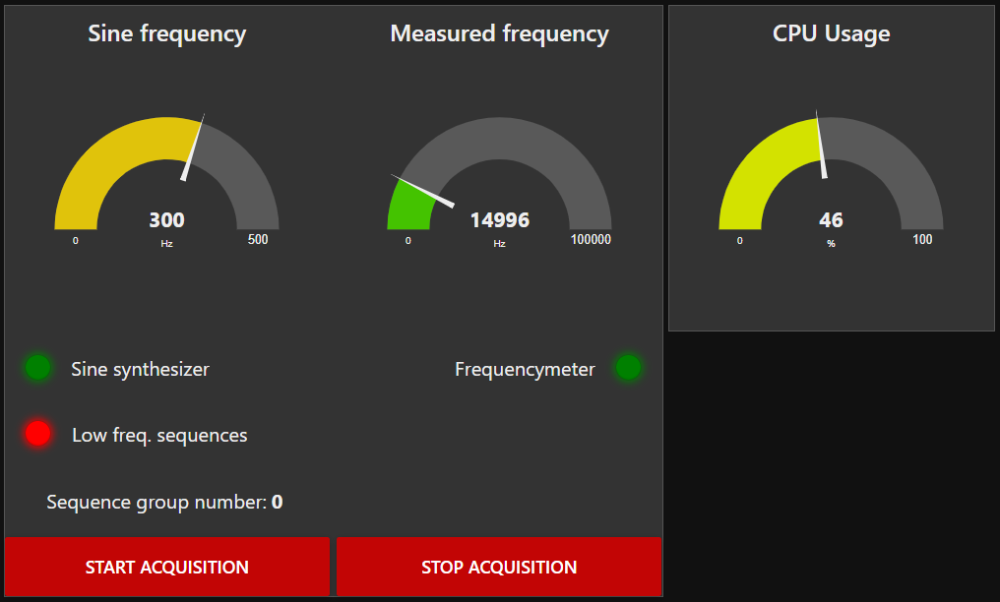
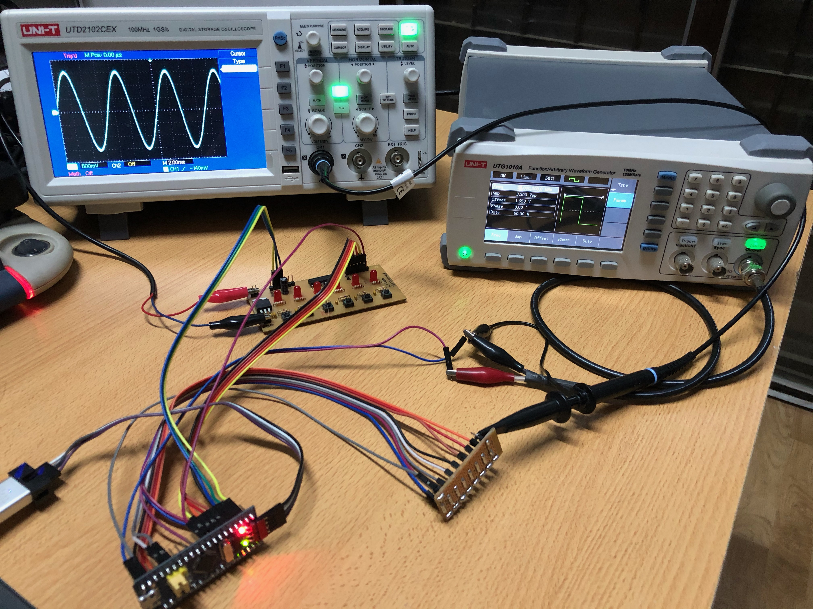
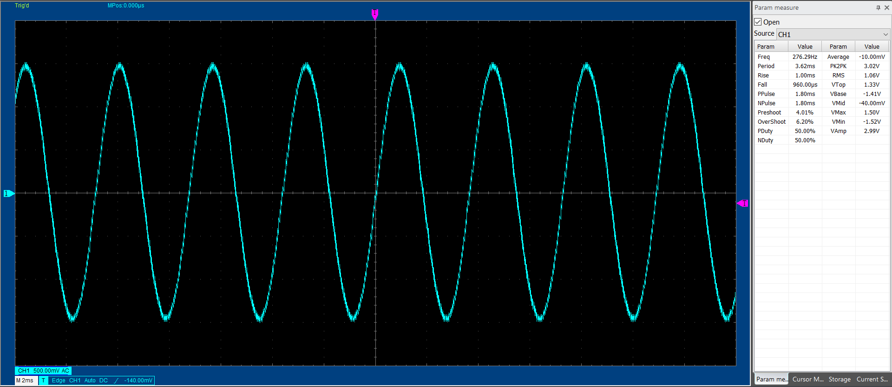

# uCOSII features test

This project was carried out during the course of an university subject. It was intended to use the main concepts of RTOS such as tasks, priorities, stack, mailboxes, semaphores, among others. It's not totally efficient since it was only for demonstrative purposes.

RTOS was used on STM32F103 microcontroller, using STM32CubeIde.
A DIO module was implemented as an abstraction layer between the app and the hardware. This was only used for very low frequency signals. As you might see later, a sinusoidal signal was generated by using an extern R2R DAC, but due to the low execution rate of the DIOTask, the signal was written directly to the output port register in a timer interruption callback (timer execution rate is indirectly reconfigifured by the user in order to change sine frequency). Lastly, the program allows to calculate the frequency of an square input signal, by using a timer capture interrupt callback.

***

## Interface

System status and meassures are shown in STM32CubeMonitor, and global variables were used because CubeMonitor requieres that. Even though it was not implemented, code structure is designed to use a LCD and manage it using the Statshowtask. Next image presents the created [testbench](CubeMonitor_testbench_flow/testbench.json). json file was exported from STM32CubeMonitor and it can be imported to test the system.

On the other hand, inputs were handled by external switches as you can see in the following picture.

Lastly, following figure shows a screenshot of the generated sine signal taken from the oscilloscope.

### STM32F103C8T6 (Bluepill) pinout

Bluepill board pinout is explained below:

* A0 -> SW1 (Sequences or sinusoidal generator)
* A1 -> SW2 (Sequence selector)
* A2 -> SW3 (Increment sinusoidal frequency)
* A3 -> SW4 (Decrement sinusoidal frequency)
* A4 -> SW5 (Frequency counter enabling)
* B4 -> Square signal input (Frequency counter)
* B8 to B15 -> R2R DAC (LSB to MSB) (Sinusoidal generator)
* C13 to C15 -> (Low frequency sequences outputs)

***

## Code

Code is very simple. The file [app.c](CubeIDE_Project/uCOSII/Core/Src/app.c) contains the tasks and functions written for this application. Another important part is [DIO module](CubeIDE_Project/uCOSII/Core/Src/DIO.c). Since it works as a hardware abstraction layer, it has to be reconfigured depending on the microcontroller you're using.

***

## Sine signal

The signal coefficients were generated in [this Matlab/Octave script](Scripts/sin_taps.m).
